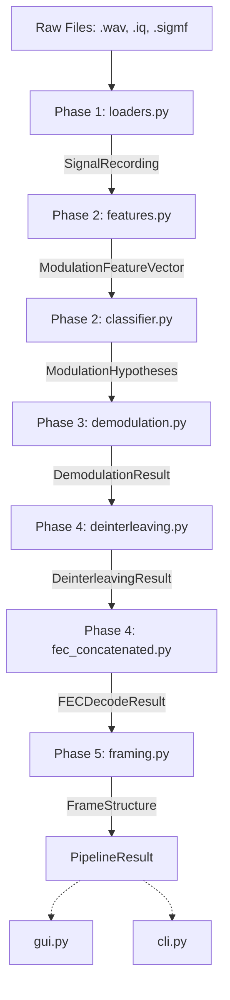

# System Architecture

The signal analysis pipeline is divided into a sequential 6-layer architecture, tied together by a strict epistemic-status tracking model that propagates confidence across stage boundaries.

## The Six-Layer Pipeline

### Phase 1: Ingestion and Metadata (loaders.py)
Reads `.wav`, `.sigmf-meta`, and raw `.iq` files into a unified `SignalRecording` object. Its explicit non-goal is guessing missing sample rates or center frequencies from bare IQ bytes—if the metadata isn't explicitly provided via SigMF or WAV headers, it is marked `MISSING` and the user is warned.

### Phase 2: Feature Extraction and Classification (features.py, classifier.py)
Measures statistical anomalies (cumulants, phase distributions, spectral moments) to identify modulation schemes. It acts as a strict gatekeeper: if a signal exhibits cyclic-prefix periodicity (OFDM) or lacks a clear discrete constellation, it aborts downstream processing and marks the hypothesis as `UNKNOWN`. It does not support OFDM/multicarrier analysis.

### Phase 3: Synchronization and Demodulation (synchronization.py, demodulation.py)
Attempts timing recovery (Gardner) and phase locking (Costas) based on Phase 2's top hypothesis. It measures EVM and lock quality, emitting hard bits and soft LLRs. It depends strictly on Phase 2 providing a valid PSK/QAM/FSK hypothesis and will not run blindly.

### Phase 4: De-interleaving and FEC (deinterleaving.py, fec_*.py)
Consumes Phase 3's `DemodulationResult` and searches for valid block interleaver dimensions and Reed-Solomon/Convolutional decoding parameters. Blind pseudo-random interleaver recovery is explicitly out of scope due to computational unfalsifiability; only bounded block interleaver grids are checked. 

### Phase 5: Frame Recovery (framing.py)
Correlates the FEC-decoded (or natively clean) bitstream against known synchronization words (e.g., HDLC flags) and verifies cyclic redundancy checks (CRCs) to slice the bitstream into valid payload packets.

### Cross-Cutting Layer: Epistemic Status Discipline
Instead of silently substituting default values or best-effort guesses, every stage outputs explicit status badges, preventing "success theater" when the pipeline fails cleanly.

## The Epistemic Status Taxonomy

This taxonomy is the single most important concept in the codebase, guaranteeing that downstream tools (and the GUI) know *exactly* what state the data is in.

*   `MetadataStatus`: Owned by Phase 1. States whether properties like sample rate are `KNOWN` (trusted), `INFERRED` (guessed from heuristics), or `MISSING`.
*   `FeatureValidity`: Owned by Phase 2. Notes if calculated features are `VALID`, `COMPROMISED` (e.g., cumulants run on real-valued signals), or `INVALID`.
*   `HypothesisStatus`: Owned by Phase 2/3. Ranges from `HYPOTHESIS_UNVERIFIED` (classifier guessed it) to `CONFIRMED` (Phase 3 successfully locked the PLL).
*   `PipelineStageStatus`: The global progression flag (`NOT_ATTEMPTED`, `COMPLETED`, `FAILED`). A stage that correctly declines to run (e.g., Phase 3 on an OFDM signal) is `NOT_ATTEMPTED`, distinguishing it cleanly from a phase that tried to run but broke (`FAILED`).

## Data Flow Diagram

