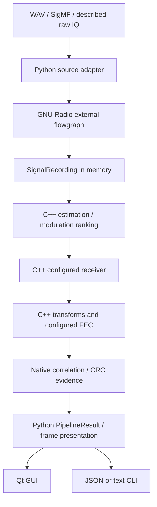

# System Architecture

## Current shape

Ordinary GUI, CLI, and Demo imports share `AnalysisRequest` and
`run_production_analysis` in Python. The workflow imports a WAV, SigMF, or
explicitly described raw-IQ recording, routes it through the GNU Radio sidecar
flowgraph, then invokes the existing analysis pipeline. GNU Radio is an
external runtime discovered by `signal_analysis.gnuradio`; set
`SIH_GNURADIO_PYTHON` when it is not on the discovery path. GUI work runs in an
`AnalysisJob`; Qt widgets are updated on the main thread.

The pybind11 extension exposes native API version 5. C++20 provides bounded
recording-source readers, preprocessing, statistics, PSD/STFT, spectral-band
analysis, parameter/modulation ranking, configured receiver and bitstream
operations, Viterbi, RS, sparse-matrix LDPC, correlation, and CRC primitives.
Python retains application orchestration, GUI models/plots, profile
configuration, JSON reports, and frame presentation. The production pipeline
uses native Phase 3–5 adapters, while older Python implementations remain for
compatibility and tests. The currently available native bounded/streaming
source API is not yet used end-to-end by ordinary GUI/CLI processing; that
workflow still materializes an in-memory recording.

The standalone experimental ExtraTrees trainer at
[`tools/train_modulation_ml.py`](tools/train_modulation_ml.py) is separate from
the production classifier. Its model is trained on generated signals and has
only a single-source BPSK transfer check; it is not used to rank production
hypotheses.

See [progress.md](progress.md) for implementation evidence and open phase
gates, [plan.md](plan.md) for the migration target, and
[KNOWN_LIMITATIONS.md](KNOWN_LIMITATIONS.md) for observed boundaries.

## Production data flow

```mermaid
flowchart TD
    File[WAV / SigMF / described raw IQ] --> Import[Python source adapter]
    Import --> GR[GNU Radio external flowgraph]
    GR --> Record[SignalRecording in memory]
    Record --> Estimate[C++ estimation / modulation ranking]
    Estimate --> Receiver[C++ configured receiver]
    Receiver --> Bitstream[C++ transforms and configured FEC]
    Bitstream --> Frames[Native correlation / CRC evidence]
    Frames --> Present[Python PipelineResult / frame presentation]
    Present --> UI[Qt GUI]
    Present --> CLI[JSON or text CLI]
```

The diagrams and stage descriptions below describe implemented interfaces;
supported profiles and validation boundaries are not implied by a stage's
presence. See progress and limitations before claiming an acceptance gate.

## Analysis stages

### Import, metadata, and preprocessing

`signal_analysis.loaders` parses WAV, SigMF, and explicit raw-IQ settings.
`signal_analysis.workflow` sends ordinary imports through the external GNU
Radio runner. The runner supports a file-source/sink pass-through and
configured frequency translation, low-pass filtering, and rational
resampling. Imported metadata is carried forward; configured output-rate
values are marked as assumptions when they are not acquisition metadata. Raw
IQ is not self-describing, and the 10 kS/s application default is explicitly
`ASSUMED`.

### Parameter and modulation analysis

The native `estimation` component returns measurements, candidates, validity,
and supporting evidence for implemented PSK, QAM, and FSK families. It can
return unknown, ambiguous, or unsupported outcomes. Scores are hypotheses,
not calibrated field probabilities. Fractional timing sampling and a
low-frequency-resolution carrier-offset guard are present. No independent,
representative multi-class real-RF calibration set is available.

### Synchronization and demodulation

The native `receiver` component supports configured receiver profiles,
fractional timing search, acquisition, symbol decisions, and max-log LLRs.
Lock and low EVM do not prove the hypothesized modulation or bit mapping.
Phase/frequency aliases and mapping status remain separate evidence. Continuous
tracking, adaptive multipath equalization, and generic CPM sequence detection
are not implemented.

### Deinterleaving, FEC, and framing

The native `bitstream` operations apply configured transforms and expose
residual input and diagnostics. Available codec operations include fixed
K=7 rate-1/2 Viterbi, RS, and normalized min-sum LDPC with caller-supplied
sparse matrices. There is no validated bundled `MACKAY_504_1008` matrix,
punctured Viterbi catalogue, erasure-aware RS path, or general blind recovery
of interleaver seeds/matrices.

Exploratory sync/CRC matches are candidates. Profile-based CRC verification
uses a predeclared header, algorithm, and payload boundary; confirmation also
requires distinct observations and verified receiver mapping. The fix for the
two historical negative-suite L5 cases has focused evidence, but the frozen
S6 and complete 10,000-window suite have not been rerun under the revised
predicate. The release zero-confirmation gate remains open/failed pending that
run.

## Optional acceleration

The `gpu` extra supplies CUDA/CuPy implementations for GUI PSD/STFT, selected
post-lock PSK/QAM and FSK operations, fixed K=7 Viterbi, zero-syndrome RS
screening, and bitstream correlation. Native CPU code remains responsible for
acquisition, RS correction, LDPC, CRC, and framing. GPU availability does not
change evidence or confirmation rules. See [GPU acceleration](docs/gpu_acceleration.md).

## Epistemic status

The pipeline separates execution from scientific evidence:

- **Metadata status** describes whether a value is known from a source, an
  explicit assumption, estimated, or missing. Do not infer absolute rate or
  frequency from bare IQ bytes.
- **Feature validity** distinguishes usable measurements from compromised or
  invalid features.
- **Hypothesis status** records candidate/unknown/ambiguous outcomes.
- **Stage status** records whether an operation was attempted, completed, or
  failed. `COMPLETED` means the stage ran; it is not a correctness verdict.
- **Mapping and frame validity** are tracked separately from receiver lock.
  A confirmed frame requires configured, repeated CRC evidence and a verified
  bit mapping; held-out validation remains a release requirement.

Demo ground truth is held in `fixtures/demo/truth.json`, separate from
production requests and reports. It is read only by the explicit reveal path.
