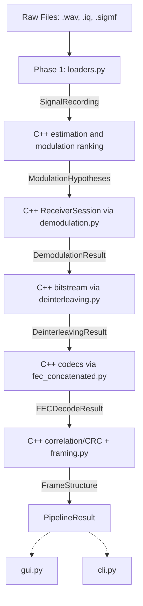

# System Architecture

## Migration status

The application currently has two explicit paths. Native API version 5 provides
chunked raw-IQ/WAV sources, preprocessing, streaming statistics, PSD/STFT,
spectral-band primitives, parameter estimation, modulation ranking, configured
receiver profiles, configured bit transforms, correlation/CRC, RS, normalized
min-sum LDPC, and the fixed Viterbi pilot through pybind11. Python retains
orchestration, GUI models, plots, reporting, profile selection, and frame
presentation. Legacy implementations remain importable for compatibility but
the production pipeline uses native Phase 3–5 adapters.
See `progress.md` for the exact validation boundary.

The signal analysis pipeline is divided into a sequential 6-layer architecture, tied together by a strict epistemic-status tracking model that propagates confidence across stage boundaries.

## The Six-Layer Pipeline

### Phase 1: Ingestion and Metadata (loaders.py)
Reads `.wav`, `.sigmf-meta`, and raw `.iq` files into a unified `SignalRecording` object. Its explicit non-goal is guessing missing sample rates or center frequencies from bare IQ bytes—if the metadata isn't explicitly provided via SigMF or WAV headers, it is marked `MISSING` and the user is warned.

### Phase 2: Estimation and modulation ranking (C++ `estimation`, Python `analysis.py`)
Measures SNR/bandwidth/CFO/rate candidates and ranks PSK, QAM, and FSK evidence. Unknown, ambiguous, and unsupported outcomes remain explicit.

### Phase 3: Synchronization and demodulation (C++ `receiver`, Python `demodulation.py`)
Runs configured carrier-line acquisition, matched filtering, fractional timing search, constellation/tone decisions, max-log LLR generation, and explicit phase/frequency ambiguity reporting. Mapping verification requires supplied reference evidence.

### Phase 4: De-interleaving and FEC (C++ `bitstream`, Python `deinterleaving.py`, `fec_*.py`)
Consumes Phase 3's `DemodulationResult` through configured native block,
convolutional, diagonal, and seeded pseudo-random transforms. Native K=7
Viterbi, RS, and configured sparse-matrix LDPC paths preserve residual input
and decode failure as evidence. Blind recovery of arbitrary permutations,
seeds, or LDPC matrices remains unsupported.

### Phase 5: Frame Recovery (C++ `bitstream`, Python `framing.py`)
Native correlation and CRC computation produce evidence for the lightweight
Python frame presenter. A repeated header is required before a CRC-8 coincidence
can elevate a frame candidate.

### Cross-Cutting Layer: Epistemic Status Discipline
Instead of silently substituting default values or best-effort guesses, every stage outputs explicit status badges, preventing "success theater" when the pipeline fails cleanly.

## The Epistemic Status Taxonomy

This taxonomy is the single most important concept in the codebase, guaranteeing that downstream tools (and the GUI) know *exactly* what state the data is in.

*   `MetadataStatus`: Owned by Phase 1. States whether properties like sample rate are `KNOWN` (trusted), `INFERRED` (guessed from heuristics), or `MISSING`.
*   `FeatureValidity`: Owned by Phase 2. Notes if calculated features are `VALID`, `COMPROMISED` (e.g., cumulants run on real-valued signals), or `INVALID`.
*   `HypothesisStatus`: Owned by Phase 2/3. Ranges from `HYPOTHESIS_UNVERIFIED` (classifier guessed it) to `CONFIRMED` (Phase 3 successfully locked the PLL).
*   `PipelineStageStatus`: The global progression flag (`NOT_ATTEMPTED`, `COMPLETED`, `FAILED`). A stage that correctly declines to run (e.g., Phase 3 on an OFDM signal) is `NOT_ATTEMPTED`, distinguishing it cleanly from a phase that tried to run but broke (`FAILED`).

## Data Flow Diagram

```mermaid
flowchart TD
    Disk[Raw Files: .wav, .iq, .sigmf] --> Loader[Phase 1: loaders.py]
    Loader -->|SignalRecording| Estimation[C++ estimation and modulation ranking]
    Estimation -->|ModulationHypotheses| Sync[C++ ReceiverSession via demodulation.py]
    Sync -->|DemodulationResult| Deint[C++ bitstream via deinterleaving.py]
    Deint -->|DeinterleavingResult| FEC[C++ codecs via fec_concatenated.py]
    FEC -->|FECDecodeResult| Framing[C++ correlation/CRC + framing.py]
    Framing -->|FrameStructure| Final[PipelineResult]
    
    Final -.-> GUI[gui.py]
    Final -.-> CLI[cli.py]
```
